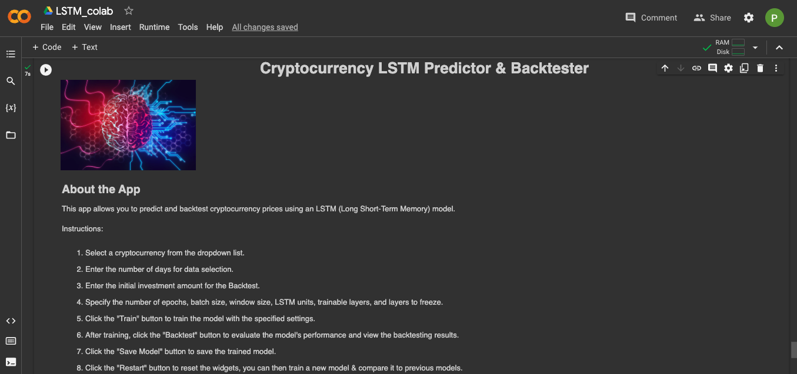
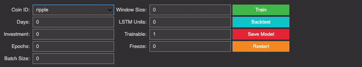
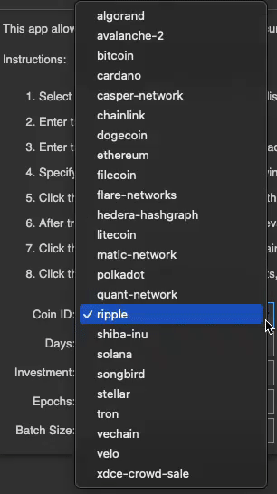
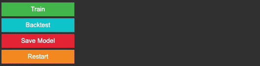
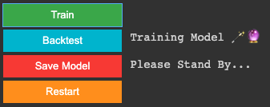
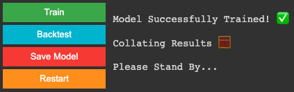
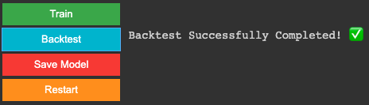
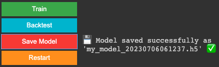
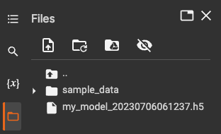
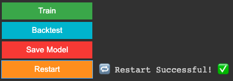

# Cryptocurrency LSTM Predictor & Backtester


The Cryptocurrency LSTM Predictor & Backtester is an interactive application that allows users to predict and backtest cryptocurrency prices using an LSTM (Long Short-Term Memory) model. The objective of this project is to develop an application that leverages LSTM models to predict cryptocurrency prices and perform backtesting.

## Overview
Cryptocurrency markets are known for their volatility and complex price patterns. The Cryptocurrency LSTM Predictor & Backtester aims to provide users with a tool to explore the predictive capabilities of machine learning models, specifically LSTM, in the cryptocurrency market. By utilising historical data, users can train an LSTM model to predict future cryptocurrency prices and evaluate its performance. Additionally, users can perform backtesting to assess the effectiveness of their trading strategies.

## Features
- **Cryptocurrency Selection:**
Choose from a dropdown list of popular cryptocurrencies.

- **Data Selection:** Specify the number of days of historical data to fetch for training and backtesting.

- **Model Parameters:** Set the number of epochs, batch size, window size, LSTM units, and the number of trainable and frozen layers.

- **Training:** Train the LSTM model using the selected cryptocurrency and specified parameters.

- **Model Evaluation:** View evaluation metrics such as MAE, MSE, RMSE, MAPE, MASE, R-squared, Median Absolute Error, and Explained Variance Score to assess the model's performance.

- **Backtesting:** Backtest the trained model using the selected cryptocurrency and evaluate the strategy's performance based on cumulative returns, total strategy returns, total trades, and win rate.

- **Save Model:** Save the trained model for future use and analysis.

- **Reset App:** Restart the app and reset all input values.

## Preview
The following gifs & images demonstrate the features & functions of the Cryptocurrency LSTM Predictor & Backtester.
### User Interface

### Input Widgets

### Coin Select Widget

### Error Handling

### Training Model

## Success Messages
### Model Trained

### Backtest

### Model Saved


### Restart



## How It Works
The Cryptocurrency LSTM Predictor & Backtester application utilises the power of LSTM models, a type of recurrent neural network, to capture long-term dependencies in cryptocurrency price data. By training the LSTM model on historical price data, the application can make predictions on future price movements. The user-friendly interface allows users to select the desired cryptocurrency, specify the model parameters, and train the model. After training, users can evaluate the model's performance using various evaluation metrics and perform backtesting to assess the profitability of their trading strategies.

## Target Audience
This application is designed for traders, cryptocurrency enthusiasts, and anyone interested in exploring the predictive capabilities of machine learning models in the cryptocurrency market. It provides a user-friendly interface that simplifies the process of training an LSTM model and performing backtesting.

## Technologies Used
The Cryptocurrency LSTM Predictor & Backtester is built using Python and leverages the following key libraries and frameworks:

`requests`: For fetching cryptocurrency data from the Coingecko API.

`numpy`: For numerical computations and array manipulation.

`pandas`: For data manipulation and analysis.

`seaborn`: For data visualization.

`datetime`: For saving the model using custom datetime string.

`matplotlib`: For creating plots and charts.

`scikit-learn`: For data preprocessing and evaluation metrics.

`tensorflow`: For building and training the LSTM model.

`ipywidgets`: For creating interactive widgets in the Jupyter Notebook.

`IPython.display`: For displaying images and HTML content in the Jupyter Notebook.

To install the required libraries, you can use the following command:

```
!pip install requests numpy pandas seaborn datetime matplotlib scikit-learn tensorflow ipywidgets
```

## Getting Started

To run the app, follow these steps:

- Clone the repository, download the source code or utilise the [Google Colab shared file link](https://colab.research.google.com/drive/1dMSu6y9V8_WNO6aNxo5J6zQAjie0p0Ip?usp=sharing) in the `src` directory's README.
- Open the Notebook containing the code.
- Ensure that the required libraries and dependencies are installed.
- Run the code cell.
- Interact with the app by selecting cryptocurrencies, setting parameters, and clicking the buttons.
- View the outputs, including model evaluation metrics and backtesting results.
- Save the trained model if desired.
- Restart the app to start a new session.

## Limitations

- The app relies on the [Coingecko API](https://www.coingecko.com/en/api/documentation) for fetching cryptocurrency data, and the availability and accuracy of data depend on the API's performance and data sources.

- The predictive accuracy of the LSTM model may vary based on the selected cryptocurrency, data availability, and the chosen parameter values.

- Backtesting results are generated based on historical data and assume that past trends and patterns will continue in the future. Real-world market conditions may differ.

- The app provides a simplified implementation and may not include all advanced features and optimisations found in professional trading systems.

## License

The Cryptocurrency LSTM Predictor & Backtester app is open-source and distributed under Group 1 License. Feel free to modify, enhance, and use the code for personal or commercial purposes.

## Acknowledgments

This app utilises various open-source libraries and APIs for data fetching, model training, and visualisation. We acknowledge the contributions of the developers and the open-source community in creating and maintaining these resources.

### Disclaimer

The Cryptocurrency LSTM Predictor & Backtester is provided for informational purposes only and should not be considered financial or investment advice. Trading cryptocurrencies carries a high level of risk, and past performance is not indicative of future results. Always do your own research and consult with a qualified financial advisor before making any investment decisions. Group 1 app developers are not responsible for any losses incurred due to the use of this app or reliance on its results.

