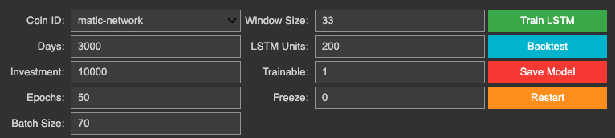
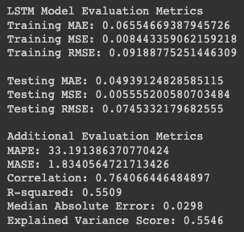
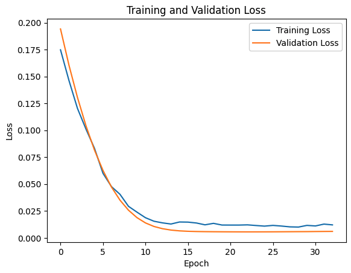
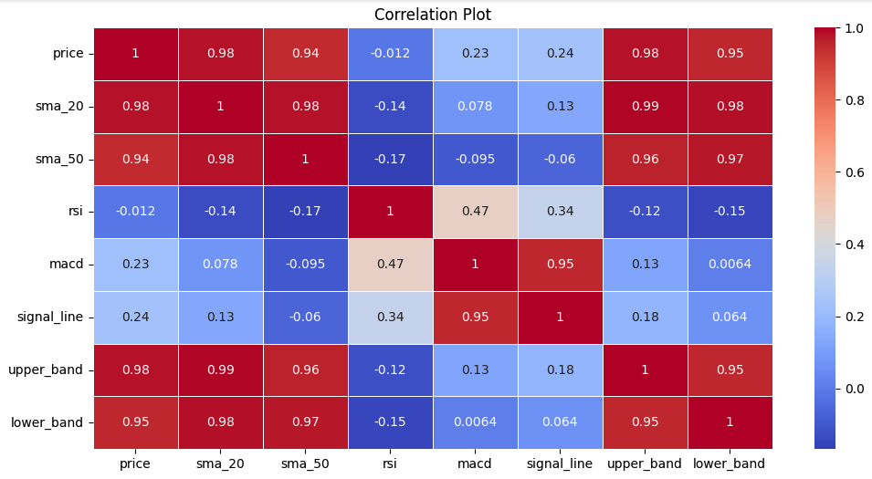
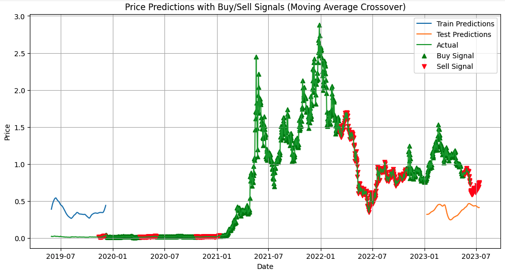
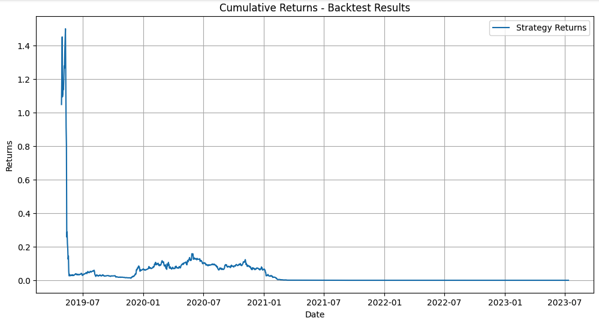
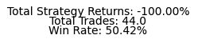

# LSTM Model Analysis

## Performance Evaluation Metrics

Analysis based on the LSTM model evaluation metrics for the Matic Network (Polygon) example over 3000 days:

- **Mean Absolute Error (MAE):** The MAE on the testing data is 0.0494. This indicates that, on average, the model's predictions deviate from the actual values by approximately 0.0494. Lower values of MAE indicate better performance.

- **Mean Squared Error (MSE):** The MSE on the testing data is 0.0056. MSE measures the average squared difference between the predicted and actual values. The lower the MSE, the better the model's performance.

- **Root Mean Squared Error (RMSE):** The RMSE on the testing data is 0.0745. RMSE is the square root of MSE and provides the error in the same unit as the target variable. A lower RMSE indicates better performance.

- **Mean Absolute Percentage Error (MAPE):** The MAPE is 33.19%, indicating that, on average, the model's predictions have a percentage difference of approximately 33.19% from the actual values. Lower MAPE values indicate better performance.

- **Mean Absolute Scaled Error (MASE):** The MASE is 1.834, which compares the performance of the model against a naive benchmark model. A value greater than 1 suggests that the model performs worse than the baseline model.

- **Correlation:** The correlation between the predicted and actual values is 0.764, indicating a moderate positive linear relationship. A correlation closer to 1 suggests a stronger relationship between the predicted and actual values.

- **R-squared:** The R-squared score is 0.5509, indicating that approximately 55.09% of the variance in the target variable is explained by the model. A higher R-squared value suggests a better fit of the model to the data.

- **Median Absolute Error:** The median absolute error is 0.0298, representing the median magnitude of the difference between the predicted and actual values. A lower value indicates better performance.

- **Explained Variance Score:** The explained variance score is 0.5546, which measures the proportion of the variance in the target variable that is explained by the model. A higher value indicates better performance.

Overall, the model demonstrates reasonably good performance, with relatively low MAE, MSE, and RMSE values. The MAPE indicates that the model's percentage errors are around 33.19%. The correlation and R-squared values indicate a moderate linear relationship and reasonable variance explanation. However, it's important to consider these metrics in the context of the specific problem and domain to determine the adequacy of the model's performance. Further analysis and comparison with other models may provide additional insights for a comprehensive evaluation.

## Training & Validation loss

**Training and Validation Loss Plot**

The training loss represents the error of the model on the training data during each epoch of training.
The validation loss represents the error of the model on the validation data during each epoch of training.
An optimal training and validation loss plot should show a decreasing trend for both lines, indicating that the model is
learning and improving its performance.
However, it is important to avoid overfitting, which is indicated by a significant gap between the training and validation
loss lines.
If the training loss continues to decrease while the validation loss starts to increase or stagnate, it suggests overfitting.

## Correlation Heatmap

**Correlation Heatmap**

The correlation heatmap visualises the pairwise correlation between different variables in the dataset.
Each cell in the heatmap represents the correlation coefficient between two variables.
The correlation coefficient measures the strength and direction of the linear relationship between variables.
The values range from -1 to 1, where -1 indicates a perfect negative correlation, 1 indicates a perfect positive correlation,
and 0 indicates no correlation.
A dark shade or high positive/negative value suggests a strong correlation, while a light shade or value close to 0 suggests
a weak or no correlation.
The correlation heatmap helps identify relationships between variables and can be useful in feature selection or identifying
multicollinearity, which is a situation in which two or more independent variables in a regression model are highly correlated with each other.

## Price Predictions With Buy / Sell Signals

**Price Predictions with Buy/Sell Signals**

The plot shows the predicted prices of the cryptocurrency along with the actual prices.
The blue line represents the predicted prices for the training period.
The orange line represents the predicted prices for the testing period.
The green line represents the actual prices.
The green triangles indicate the buy signals, which suggest favorable conditions for buying.
The red triangles indicate the sell signals, which suggest favorable conditions for selling.
These signals are generated based on the Moving Average Crossover indicator.
The Moving Average Crossover indicator helps identify potential trends and changes in momentum in the price of an asset.
This method helps to gain insights into potential buy and sell signals.

## Cumulative Returns - Backtest Results

**Cumulative Returns - Backtest Results**

This plot shows the cumulative returns of the strategy based on the backtesting results.
The cumulative returns represent the performance of the strategy over time.
A rising curve indicates positive returns, while a declining curve suggests negative returns.
The 'Strategy Returns' line represents the cumulative returns of the strategy.

- **Total Strategy Returns:** $-9999.96
It is calculated as the difference between the final cumulative returns and the initial investment amount.
A positive value signifies a profitable strategy, while a negative value indicates losses.

- **Total Trades:** This metric reveals the total number of buy/sell trades made by the strategy during the backtesting period.
It provides insight into the frequency of trading activity and the level of engagement of the strategy.

- **Win Rate:** This metric represents the win rate of the strategy, calculated as the percentage of winning trades.
It indicates the proportion of trades that resulted in positive returns out of all trades executed.
A higher win rate suggests a higher probability of profitable trades, but it should be considered alongside other performance metrics.

## Summary

It's important to note that the performance of a trading strategy is highly dependent on various factors such as market conditions, trade execution, risk management, and the specific rules or indicators used in the strategy. While a win rate of 50.42% suggests a balanced outcome in terms of profitable and losing trades, the negative total strategy returns indicate that the strategy as a whole did not generate positive returns during the backtesting period.

It is recommended to further analyse and evaluate the strategy's performance by considering additional metrics such as average profit/loss per trade, maximum drawdown, risk-reward ratio, and comparison with relevant benchmarks or alternative strategies. Additionally, conducting further analysis and robustness testing can provide insights into the strategy's performance under different market scenarios.

