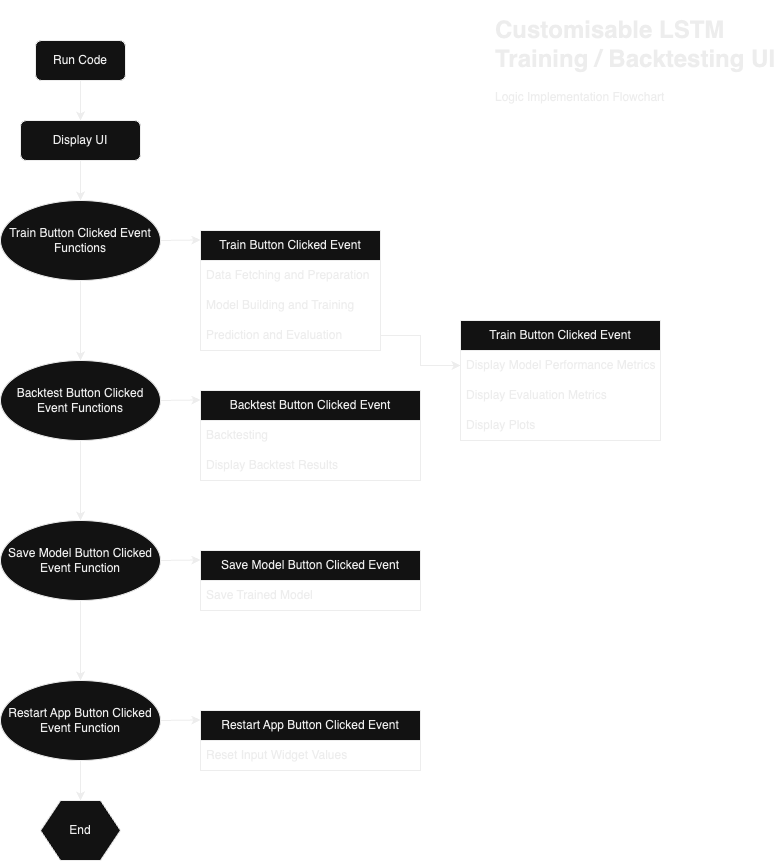

# `Preparation`
- Preparation Directory

This directory contains all relevent preparation information for the project.

# Project Scope

Project Scope for Cryptocurrency LSTM Predictor & Backtester App:

1. **Collect Cryptocurrency Data**
   - Fetch data from the Coingecko API for selected cryptocurrencies.

   - Retrieve historical price data for a specified number of days.

2. **Calculate Technical Analysis (TA) Features**
   - Apply various TA indicators to the price data.

   - Calculate features such as Simple Moving Average (SMA), Relative Strength Index (RSI), MACD, and Bollinger Bands.

3. **Prepare Data for Model Training and Testing**

   - Split the data into train and test sets.

   - Fill missing values with 0.
   - Scale the data using MinMaxScaler.
   - Create input-output pairs for LSTM model training.

4. **Build and Train LSTM Model**
   - Define the LSTM model architecture.

   - Set trainable and frozen layers as per user input.
   - Compile the model with mean squared error loss and Adam optimizer.
   - Train the model using the training data.
   - Implement early stopping to prevent overfitting.

5. **Evaluate Model Performance**
   - Calculate evaluation metrics such as MAE, MSE, RMSE, MAPE, MASE, correlation, R-squared, median absolute error, and explained variance score.
   
   - Visualise training and validation loss over epochs.
   - Generate a correlation heatmap to identify variable relationships.

6. **Generate Buy/Sell Signals**
   - Use MACD indicator with specified parameters to generate buy and sell signals.

   - Compare short-term and long-term moving averages to determine signal direction.

7. **Visualise Predictions and Signals**
   - Plot predicted prices along with actual prices for training and testing periods.

   - Display buy and sell signals on the price plot.

8. **Backtest the Model**
   - Perform backtesting using predicted prices and signals.

   - Calculate strategy returns based on position changes.
   - Calculate cumulative returns and total strategy returns.
   - Plot cumulative returns over time.

9. **Save Trained Model**
   - Save the trained LSTM model for future use.

10. **User Interface**
    - Create an interactive user interface using ipywidgets.

    - Allow users to select cryptocurrency, input parameters, and initiate model training and backtesting.

# Logic Implementation Flowchart
