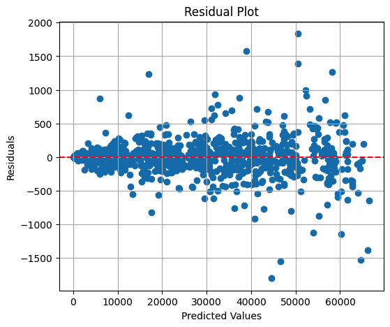
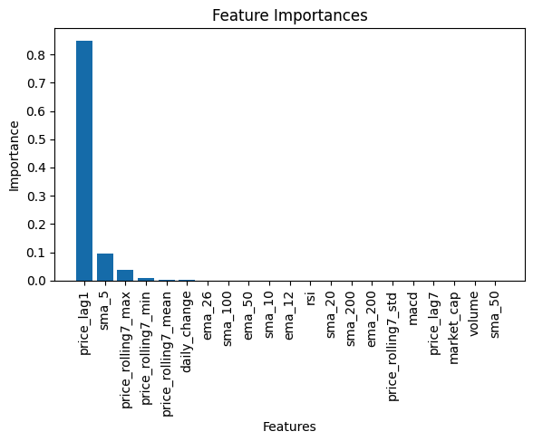

# Random Forest Regression Model Analysis

The analysis of the model's performance is as follows:

The MSE measures the average squared difference between the predicted and actual values. In this case, the MSE is relatively high, indicating that there is a significant amount of variance or error in the model's predictions. Lower MSE values indicate better performance, so there is room for improvement in reducing the prediction errors.
Root Mean Squared Error (RMSE): 504.4344450304433

The RMSE is the square root of the MSE and provides the error in the same unit as the target variable (price in this case). It is a popular metric as it is interpretable and directly comparable to the target variable. The RMSE value indicates the average magnitude of the prediction errors. In this case, the RMSE is relatively high, suggesting that the model's predictions have a significant average difference from the actual prices.
Mean Absolute Error (MAE): 184.24433274417697

The MAE measures the average absolute difference between the predicted and actual values. It is less sensitive to outliers compared to MSE and provides a more robust evaluation of model performance. The MAE value indicates the average magnitude of the prediction errors, regardless of their direction. In this case, the MAE is relatively high, indicating that, on average, the model's predictions have a significant absolute difference from the actual prices.
R-squared (R^2) Score: 0.9989602883126095

The R-squared score indicates the proportion of the variance in the target variable (price) that is predictable from the features used in the model. A higher R-squared value (closer to 1) indicates a better fit of the model to the data. In this case, the R-squared score is close to 1, suggesting that the model explains a significant portion of the variance in the target variable. However, it's important to note that R-squared can be inflated by adding more features, so its interpretation should be considered carefully.

Overall, the model demonstrates a high R-squared value, indicating a good fit to the data. However, the relatively high MSE, RMSE, and MAE values suggest that there is room for improvement in reducing the prediction errors. Further analysis and model refinement may be necessary to enhance the model's performance.

## Daily Price Change Vs Volume

**Correlation between daily price change and volume:** -0.006201038252788101

This scatter plot shows the relationship between the daily price change and trading volume of the cryptocurrency. Each data point represents a specific day, and its position on the plot is determined by the corresponding daily price change and volume. The color of the data points represents the volume, with the colorbar indicating the volume range.
By examining the plot, you can assess any visual patterns or trends between the daily price change and trading volume. However, in this case, the correlation between the two variables is provided separately, indicating a weak linear relationship.

## Learning Curve

**Learning Curve:**

The learning curve plot displays the relationship between the training set size and the model's performance score. It includes two lines: the training score and the validation score. The training score represents the model's performance on the training data as the training set size increases, while the validation score reflects the model's performance on unseen data (validation set) as the training set size increases.
By analysing the learning curve plot, you can evaluate whether the model suffers from underfitting, overfitting, or achieves a good fit. Look for convergence and the gap between the training and validation scores. Adjustments like gathering more data or modifying the model may be required based on the observed patterns.

## Residual Plot

**Residual Plot:**

The residual plot is used to assess the quality of a regression model. It displays the predicted values on the x-axis and the residuals (differences between predicted and actual values) on the y-axis. The red dashed line at y=0 represents the ideal scenario where the residuals are centered around zero.

By examining the residual plot, you can evaluate whether the residuals are randomly distributed around the y=0 line or if there are any patterns or trends. Ideally, the residuals should be randomly scattered around the line, indicating that the model's predictions are unbiased and have constant variance. If patterns or trends are observed, it suggests that the model may have systematic errors or unequal spread of residuals.

## Distribution of Residuals

**Distribution of Residuals:**

The histogram of residuals shows the distribution of the errors or residuals of the model's predictions. Residuals are the differences between the predicted values and the actual values. The histogram visualises the frequency of different ranges of residuals.

By examining the histogram of residuals, you can assess the model's performance and identify any systematic patterns or anomalies in the errors. Look for a bell-shaped curve centered around zero, indicating a normal distribution. Skewness or outliers in the histogram may indicate that the model is not capturing certain patterns or data points correctly.

## Predicted Prices VS Actual Prices

**Scatter Plot of Predicted and Actual Prices:**

This scatter plot compares the predicted prices (x-axis) with the actual prices (y-axis). Each data point represents a specific instance, and its position on the plot is determined by the predicted and actual price values. The scatter plot aims to visualise the relationship and agreement between the predicted and actual prices.

By examining the scatter plot, you can assess how well the model's predictions align with the actual prices and identify any patterns or discrepancies. Look for a strong positive correlation where the data points form a diagonal line. Deviations from the line may indicate differences between predicted and actual prices, while the spread of data points indicates the model's accuracy in predicting prices.

**Feature Importances:**

The feature importances plot showcases the importance of each feature in the model's predictions. The height of each bar represents the importance value, and the features are sorted in descending order based on their importance.

By examining the feature importances plot, you can identify the most influential features and gain insights into the factors driving the model's predictions. Pay attention to the top-ranked features, as they have the highest impact on the model's predictions.

**3D Cube Plot of Feature Importances:**

The 3D cube plot provides a visual representation of feature importances. The x-axis represents the features, the y-axis represents the index of the features, and the z-axis represents the importance values of the features. The size and color of the markers indicate the importance values.

By examining the 3D cube plot, you can visually identify the most important features based on their position and marker characteristics. This plot offers an alternative perspective for understanding the relative importance of different features.

### Summary

These plots serve as valuable tools for assessing and interpreting the model's performance, understanding the relationships between variables, and identifying areas for improvement or further investigation.

